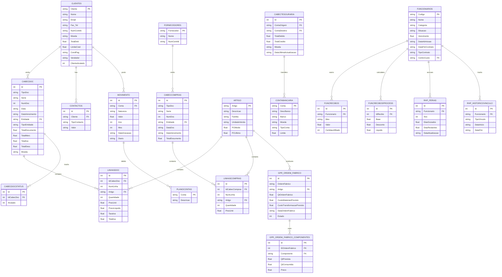

# Database Schema — ERP Finance

Complete entity-relationship diagram and data model documentation.

## Entity-Relationship Diagram

## Entity Descriptions

### Core Financial Entities

**Clientes (Customers)**
Master file for all customer accounts. Tracks company name, contact info, NIF (tax ID), currency, credit limit, payment terms, and sales rep assignment. Connected to all sales documents and receivables.

**Fornecedores (Vendors)**
Master file for supplier accounts. Minimal schema: code, name, NIF. Used for purchase document validation and vendor risk analysis.

**Artigo (Products)**
Inventory master. Contains product description, family classification, sales unit, and costing (average and last purchase price). Used in sales lines, purchase lines, and manufacturing orders.

**Contabancaria (Bank Accounts)**
Bank account master. Tracks account number, bank name, currency, account type (checking, savings), and available credit limit. Used for treasury and liquidity reporting.

### Sales & Receivables

**CabecDoc (Sales Document Headers)**
All sales invoices, credit notes, and proforma documents. Key fields: document type (FT=invoice, NC=credit note), series, number, date, due date, customer, total amount, tax breakdown. Status tracked separately in CabecDocStatus.

**LinhasDoc (Sales Document Lines)**
Line items for each sales document. Contains product, quantity, unit price, discount, net price, tax rate, and tax amount. Enables invoice detail view and product profitability analysis.

**CabecDocStatus (Document Status)**
Tracks whether documents are cancelled/reversed. Single field: Anulado (0=active, 1=cancelled). Separated for normalization and audit trail.

### Payables & Purchases

**CabecCompras (Purchase Document Headers)**
Mirrors sales structure but for vendor purchases. Document type, series, number, date, due date, vendor, totals. Used for payables aging and supplier analysis.

**LinhasCompras (Purchase Document Lines)**
Line items for purchases. Product, quantity, unit cost. Simpler than sales lines (no discounts, tax not tracked per line).

### Treasury

**CabecTesouraria (Cash Transfers)**
Bank-to-bank transfers and cash movements. Source account, destination account, debit/credit amounts, currency, date. Used for liquidity forecasting and cash position.

### General Ledger

**PlanoContas (Chart of Accounts)**
Account master file. Each account has a code (up to 8 digits, hierarchical) and description. Supports multi-level account hierarchies for rollup reporting.

**Movimento (GL Entries)**
Posted accounting entries. Account, debit/credit nature (D/C), amount, fiscal year, month, posting date, journal code. Enables income statement (class 60-89), balance sheet (classes 1-5), and cost center analysis.

### HR & Payroll

**Funcionarios (Employees)**
Employee master. Name, job category, status (Active/Inactive), base salary, hire date, contract end date, contract type, cost center. Used as dimension for HR analytics.

**FuncRecibos (Payroll Stubs)**
Monthly payroll summary per employee. Contains gross amount, citizen certificate indicator. One record per employee per month.

**FuncRecibosProcs (Payroll Calculations)**
Detailed payroll calculations. Base amount, deductions (taxes, social security), net amount. Enables take-home pay analysis and cost allocation.

**RHP_Ferias (Vacation)**
Annual vacation accrual and usage tracking. Days earned, days taken, days remaining per employee per year. Compliance reporting and PTO forecasting.

**RHP_HistoricoVinculo (Employment History)**
Career history per employee. Employment type, start date, end date. Used for tenure analysis and flight-risk identification.

### Manufacturing

**GPR_OrdemFabrico (Manufacturing Orders)**
Production orders. Product, quantity ordered, forecasted costs (materials, labor, overhead), actual costs, order date, completion status. Enables production cost accounting and variance analysis.

**GPR_OrdemFabricoComponentes (BOM Consumption)**
Bill of Materials consumed per production order. Component product, planned quantity, actual consumed quantity, unit cost. Used to track material consumption variance.

## Key Design Patterns

### Dual Storage (Real & Demo)

The SQLite demo database (`server/db/schema.sql`) mirrors the shape and
relationships of the PRIMAVERA SQL Server schema documented above for the
~20 entities the app actually reads, so both backends can implement the same
function contract (`getReceivables()`, `getDashboard()`, etc.) and return
data in the same shape. The demo schema is a purpose-built approximation, not
a byte-for-byte copy of PRIMAVERA's table/column names — see `ARCHITECTURE.md`
§4.1 for the demo table list.

### Fact vs. Dimension

Sales documents (CabecDoc) and payroll (FuncRecibos) are facts. Customers, products, employees are dimensions. Enables dimensional analysis (drill-down by customer, product, employee) without repeated data.

### Soft Delete (Anulado Flag)

Documents are never physically deleted. CabecDocStatus.Anulado=1 marks documents as cancelled. Preserves audit trail and allows reversal recovery.

### Separation of Concerns

CabecDoc contains header-level data (customer, date, terms). LinhasDoc contains line-level data (products, quantities). CabecDocStatus tracks status independently. Allows updating status without modifying header.

## Indexing Strategy

Production queries use indexed lookups:
- Customer sales: INDEX(CabecDoc.Entidade, CabecDoc.Data)
- Receivables aging: INDEX(CabecDoc.DataVencimento, CabecDocStatus.Anulado)
- GL balance: INDEX(Movimento.Conta, Movimento.Ano, Movimento.Mes)
- Employee payroll: INDEX(FuncRecibos.Funcionario, FuncRecibos.Mes)

## Data Volume Estimates

| Entity | Demo Records | Production Typical |
|---|---|---|
| Clientes | 25 | 500-5000 |
| Artigo | 100 | 1000-50000 |
| CabecDoc (annual) | 150 | 5000-50000 |
| Movimento (annual) | 10000 | 50000-500000 |
| Funcionarios | 10 | 50-500 |
| FuncRecibos (annual) | 120 | 600-6000 |

---

See [API.md](./API.md) for endpoint documentation and [SECURITY_AUDIT.md](./SECURITY_AUDIT.md) for data access control patterns.
