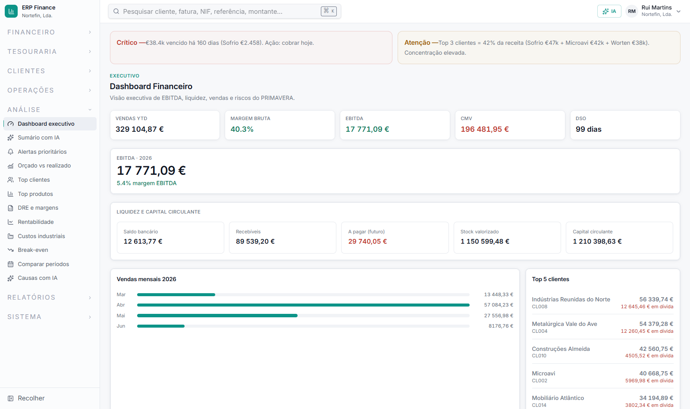
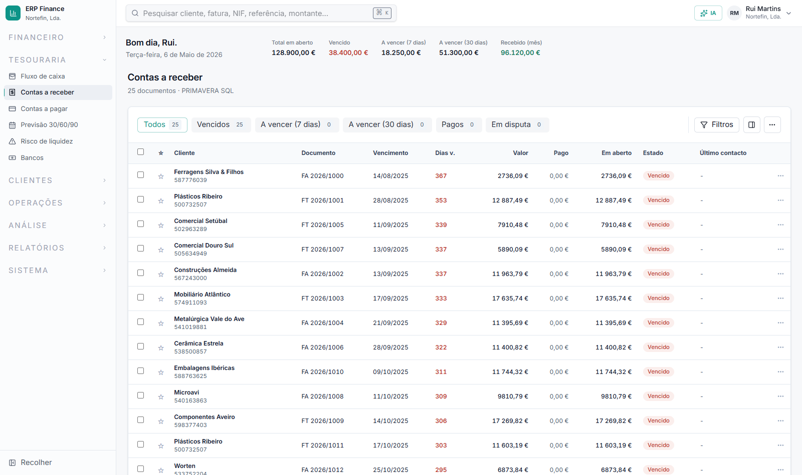
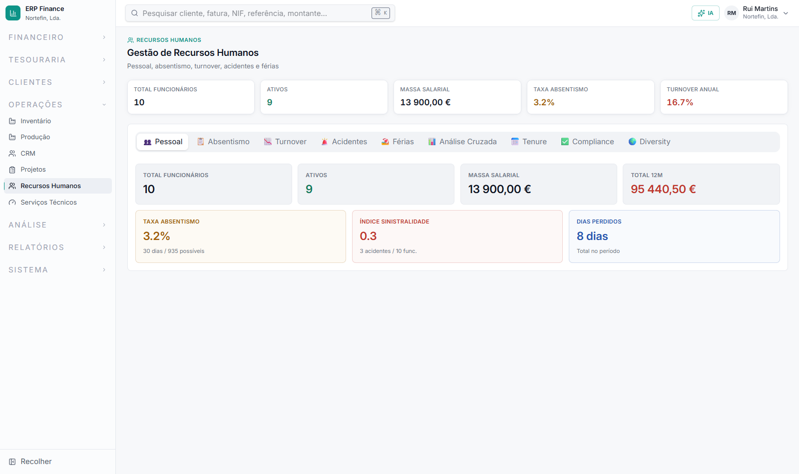

# ERP Finance

Financial operations dashboard for enterprise resource planning, built with React and Node.js. Designed for financial controllers and CFOs to monitor cash flow, receivables, payables, profitability, and HR analytics with real-time data from ERP systems.

**Live demo:** https://lowtechpt.github.io/ERP_Finance_Public/





## Features

- **Dashboard Executive**: Real-time KPIs for revenue, expenses, profit, cash position, and top customers
- **Contas a Receber**: Accounts receivable with aging analysis, payment tracking, and collection workflows
- **Contas a Pagar**: Payables management with vendor filtering, due date tracking, and payment scheduling
- **Cash Flow & Tesouraria**: Bank accounts, liquidity forecasting (30/60/90 days), and cash position monitoring
- **DRE (Income Statement)**: Multi-period profit & loss with cost of goods, gross margin, and operating income
- **Vendas & Análise**: Sales by customer/product, profitability per product, period comparisons, break-even analysis
- **Contabilidade**: General ledger, chart of accounts, journal entries, and accounting movement queries
- **RH Module**: Employee payroll, absenteeism, turnover analysis, tenure tracking, compliance, and diversity metrics
- **Manufatura**: Production order tracking, component consumption, and cost allocation to manufactured goods
- **Gestão de Risco**: Credit risk assessment, concentration analysis, liquidity risk indicators, and alerts
- **AI Workspace**: Gemini-powered chat for financial insights, anomaly detection, and business recommendations
- **Alertas**: Configurable thresholds and monitoring rules for KPI tracking with email notifications

## Tech Stack

### Frontend
- **React 19** with TypeScript (strict mode)
- **Vite** for fast development and optimized production builds
- **Tailwind CSS 4** with responsive design (mobile-first)
- **Radix UI** primitives (navigation, dialogs, accordions)
- Hand-built SVG/CSS chart primitives (`src/components/metrics.tsx`) — no charting
  library; bar/trend visuals are plain elements sized by inline styles
- **shadcn/ui**-style component patterns (Radix + `class-variance-authority`, not the
  npm package)
- **React.lazy + Suspense** for code splitting and performance
- Bundle size: 332 KB (102 KB gzipped) — see [Performance Metrics](#performance-metrics)

### Backend
- **Node.js 22+**, hand-written on top of `node:http` — no Express, no framework
- Written in **TypeScript** (`server/**/*.ts`, strict mode + `noUnusedLocals`/`noUnusedParameters`), compiled with `npm run build:server` to `dist-server/` and run as plain Node
- **Zero runtime dependencies** — the API imports only Node built-ins (`node:http`, `node:path`, `node:fs/promises`, `node:url`, `node:sqlite`, `node:child_process`), so the production Docker image ships with no `node_modules` at all
- **Dual database support**, same function contract either way:
  - **SQL Server** (production) — shells out to the `sqlcmd` CLI via `node:child_process` (not a driver, not parameterized; mitigated by input validation — see [SECURITY_AUDIT.md](./SECURITY_AUDIT.md))
  - **SQLite** (demo, portable) — via Node's built-in `node:sqlite` module, no native driver
- **Security hardening**: Input validation, rate limiting, CORS, CSP headers
- Deterministic demo data (seeded PRNG) for reproducible testing

### Database
- **PRIMAVERA ERP v10** (SQL Server) for production
- **SQLite 3** for portable demo mode, built from `server/db/schema.sql` + `server/db/seed-data.ts`
- **Data domains**: Customers, Vendors, Products, Sales Orders, Purchase Orders, GL Entries, Employees, Manufacturing Orders, Bank Accounts
- No ORM, no migrations — the demo database is fully regenerated from schema + seed script; production is PRIMAVERA's own schema, read-only from this app's side

### Deployment & DevOps
- **Docker** with multi-stage builds (demo and development targets); the demo image installs no `node_modules` and runs as the non-root `node` user
- **GitHub Actions** CI: checkout → Node 22 → `npm ci` → typecheck → build → Jest tests → Node backend tests → coverage artifact upload (no database container, no Codecov)
- Production-ready HSTS, CSP, and CORS security headers

## Quick Start

### Local Development (No Database Setup)

```bash
# Install dependencies
npm install

# Start backend + frontend (SQLite demo mode)
npm run dev

# Frontend: http://127.0.0.1:5173
# Backend API: http://127.0.0.1:5000/api/health
```

### Docker Deployment (Recommended)

```bash
# Build and run production containers
docker-compose up -d

# Access: http://localhost:5000
# Health check: curl http://localhost:5000/api/health
```

### Production Build

```bash
# Compile TypeScript and build optimized bundle
npm run build

# Output: dist/ (frontend static files)
# Backend: npm run dev:api (or deploy via Docker)
```

### Database Initialization

```bash
# Build/seed the SQLite demo database (server/db/erp-finance-demo.sqlite)
npm run seed:demo
```

There is no migration tooling — the demo database is fully regenerated from
`server/db/schema.sql` + `server/db/seed-data.ts` on every `npm run seed:demo`.
The production database is PRIMAVERA's own SQL Server schema, managed outside
this project; the app only reads from it.

## Project Structure

```
ERP Finance/
├── src/
│   ├── App.tsx                          # Main router (23 pages + AI workspace)
│   ├── pages/                           # 23 financial dashboards
│   │   ├── DashboardPage.tsx            # Executive dashboard
│   │   ├── CashFlowPage.tsx             # Tesouraria, bank accounts
│   │   ├── PayablesPage.tsx             # Contas a pagar
│   │   ├── BanksPage.tsx                # Bank account details
│   │   ├── DREPage.tsx                  # Income statement
│   │   ├── ProfitabilityPage.tsx        # Product profitability
│   │   ├── BreakEvenPage.tsx            # Break-even analysis
│   │   ├── HRPage.tsx                   # HR analytics (9 tabs)
│   │   ├── IndustrialCostsPage.tsx      # Manufacturing costs
│   │   ├── LiquidityPage.tsx            # Liquidity metrics
│   │   ├── AlertsPage.tsx               # Alert configuration
│   │   └── ... (13 more pages)
│   ├── components/
│   │   ├── PageWrapper.tsx              # Gradient layout wrapper
│   │   ├── SectionHeader.tsx            # Category + title + description
│   │   ├── KPIGrid.tsx                  # Responsive KPI card grid
│   │   ├── DataTable.tsx                # Sortable data table
│   │   ├── metrics.tsx                  # StatusBadge, MetricCard, Activity
│   │   ├── ai/                          # AI workspace components
│   │   └── ui/                          # Radix-based primitives
│   ├── lib/
│   │   ├── format.ts                    # Currency, date, number formatting
│   │   ├── receivables.ts               # Receivables domain logic
│   │   └── utils.ts                     # Tailwind classname merging
│   └── styles.css                       # Tailwind directives
├── server/
│   ├── primavera-api.ts                 # Hand-written node:http server (no framework)
│   ├── backends/
│   │   ├── sqlserver.ts                 # Shells out to sqlcmd (production)
│   │   └── demo.ts                      # node:sqlite reader (portable)
│   └── db/
│       ├── schema.sql                   # SQLite demo schema
│       ├── seed-data.ts                 # Deterministic demo data
│       ├── build-demo-db.ts             # SQLite database builder
│       ├── sqlite-client.ts             # SQLite query wrapper
│       └── generate-static-snapshots.ts # GitHub Pages snapshots
├── dist-server/                         # Compiled backend output (tsc, gitignored)
├── .github/workflows/
│   ├── ci.yml                           # Typecheck + build + tests
│   └── deploy-pages.yml                 # GitHub Pages deployment
├── vite.config.ts                       # Vite build configuration
├── tsconfig.json / tsconfig.server.json # TypeScript compiler options (frontend / backend)
└── docker-compose.yml                   # Container orchestration
```

There is no ORM, no entities, and no migration system in this project — an
earlier TypeORM/`mssql` experiment was removed because it was never wired up
and broke the build; both backends query their databases directly (parameterized
SQLite calls, and validated-input `sqlcmd` text for SQL Server).

## Key Architecture Decisions

### Dual Backend (SQL Server + SQLite)

Production deployments connect to PRIMAVERA ERP via SQL Server (Windows integrated auth). Demo and public versions use SQLite with deterministic seed data. Both backends implement the same interface, allowing developers to test locally without database setup.

### Design System Components

Eliminated code duplication across 23 pages by extracting reusable components: `PageWrapper` (full-width, no max-width — an operational dashboard uses the whole viewport), `SectionHeader` (category + title), `KPIGrid` (fluid `repeat(auto-fit, minmax(190px, 1fr))` grid, not a fixed column count), `DataTable` (sortable table). Semantic design tokens (`bg-page`, `text-danger`/`-success`/`-warning`/`-info`, `--color-sidebar*`) replace raw Tailwind palette classes throughout — see [Color Palette & Typography](./ARCHITECTURE.md#54-color-palette--typography) in ARCHITECTURE.md.

### Type Safety

TypeScript strict mode across frontend and backend, no ORM/decorators. `any` is not eliminated — the SQL backends return `Promise<any[]>` for raw query rows shaped by PRIMAVERA's schema — but it's not the default either; see [CONTRIBUTING.md's TypeScript section](./CONTRIBUTING.md#typescript).

### Security Hardening

Input validation (sanitization of limit, offset, metric parameters). Rate limiting (100 req/min per IP). CSP headers restrict connect-src to self + Gemini API only. HSTS enabled in production. POST requests limited to 100 KB, JSON content-type enforced.

### Performance Optimization

Code splitting via React.lazy + Suspense — every page and the AI Workspace load on-demand, only the visited route downloads its chunk. Bundle analyzer (`rollup-plugin-visualizer`) configured. HTTP cache headers (5 min for dashboard/receivables, 1 hr for health/modules). FCP/LCP targets of &lt; 1.5s / &lt; 2.0s are stated goals, not measured Lighthouse scores — no Lighthouse run has been published for this project.

## Features Deep Dive

### Executive Dashboard
Real-time KPIs aggregated from Clientes, CabecDoc (sales), Movimentos (accounting). Shows revenue (YTD and 6-month trend), expenses, operating profit, cash position, and top 5 customers by value. DSO (Days Sales Outstanding) calculated as (Receivables / Daily Revenue).

### Accounts Receivable Workflow
Lists all open invoices with aging buckets (Current, 30, 60, 90+ days). Side panel shows document details, line-item breakdown, payment history, and allows quick actions (email reminder, register payment, open in ERP). Supports filtering by customer, status, and date range.

### HR Analytics Module
9 integrated tabs covering personnel overview, absenteeism by department (with sick/unjustified/license breakdown), turnover rate and costs, accident tracking with severity levels, vacation accrual/usage, cross-departmental correlation analysis, tenure distribution with flight-risk identification, compliance training status, and diversity metrics (gender, age, cost center distribution).

### AI Workspace
Gemini 2.0 Flash integration. Chat panel accepts free-form questions about financials. Backend aggregates data from 6+ endpoints in parallel (dashboard, cashflow, payables, receivables, DRE, production costs). AI responds with insights, anomalies, and recommendations. Context-aware topic detection (collections, production, liquidity, personnel) switches display mode.

### Risk & Alerts
Configurable thresholds for KPI monitoring. Examples: receivables aging > 60 days, cash position < threshold, payables due tomorrow, absenteeism spike. Alerts stored with severity (info/warning/critical) and notification channels (dashboard toast, email via integration).

## API Reference

Complete API documentation at [API.md](./API.md).

Key endpoints:
- `GET /api/health` — Server and database status
- `GET /api/dashboard` — Executive KPIs
- `GET /api/receivables` — Accounts receivable aging
- `GET /api/payables` — Accounts payable summary
- `GET /api/cashflow` — Bank accounts and liquidity
- `GET /api/customers` — Customer list with sales totals
- `GET /api/hr` — HR analytics and payroll
- `GET /api/dre` — Income statement by period
- `POST /api/ai/chat` — Gemini AI integration

All endpoints validated for security (input sanitization, rate limiting, CORS).

## Deployment

### Local (Development)
```bash
npm install && npm run dev
```

### Docker (Production)
```bash
docker-compose up -d
# Frontend: http://localhost:5000
# API: http://localhost:5000/api
```

### GitHub Pages (Static)
```bash
npm run build:static
# Pushes to public-release branch for GitHub Actions to deploy
```

### Cloud (AWS/DigitalOcean/Heroku)
See [DEPLOYMENT.md](./DEPLOYMENT.md) for detailed cloud deployment steps.

## Testing

```bash
# Unit tests + coverage
npm run test

# Watch mode for TDD
npm run test:watch

# Node backend tests (compiled demo backend)
npm run test:node

# Typecheck + Jest + Node tests
npm run test:all
```

**Test Coverage (honest numbers)**: 323 Jest tests across 40 suites — all 23
dedicated pages (`src/pages/__tests__/`), the shared component layer
(`PageWrapper`, `SectionHeader`, `KPIGrid`, `DataTable`, `PageEmptyState`,
`PageLoadingState`), the AI workspace components, and `src/lib/`'s pure
functions — plus 43 Node tests (`server/__tests__/`, run against the compiled
backend for both the demo and SQL Server code paths). **366 tests total, all
passing.** Overall line coverage is 43.7%; several `src/lib/` modules and
components sit at 100% statements/branches/functions/lines, enforced via
per-file Jest coverage thresholds rather than a single global number. The
`ModulePage.tsx` generic router (distinct from the 23 dedicated pages) has no
dedicated test yet. Playwright is configured (`npm run test:e2e`) but **E2E
tests are not part of CI** — run them locally if you want to exercise them.

## Contributing

See [CONTRIBUTING.md](./CONTRIBUTING.md) for development guidelines, code style, and PR process.

**Code Standards**:
- TypeScript strict mode everywhere (`tsconfig.app.json`, `tsconfig.server.json`).
  `any` is not banned — the SQL backends return `Promise<any[]>` from raw query
  results by design, since the shape comes from whatever PRIMAVERA's schema
  returns — but it is not eliminated either; tightening those call sites is a
  known follow-up, not a finished claim.
- React hooks best practices (useEffect cleanup, proper dependencies)
- Tailwind utilities only (no inline styles)
- Semantic HTML (header, nav, main, section)
- Accessibility (ARIA labels, keyboard navigation)

## Performance Metrics

- **Bundle size (initial route)**: 332 KB (102 KB gzipped) as of the last
  `npm run build`; re-check with `npx vite-bundle-visualizer` or the generated
  `dist/stats.html`
- **FCP / LCP targets**: < 1.5s / < 2.0s — stated goals, not a measured
  Lighthouse run; no Lighthouse score is published for this project
- **Responsive**: 480px (mobile), 768px (tablet), 1024px+ (desktop)

## Browser Support

- Chrome/Edge (latest 2 versions)
- Firefox (latest 2 versions)
- Safari (iOS 14+, macOS 12+)
- Mobile browsers (responsive design, touch-optimized)

## Security

**There is no authentication of any kind today** — every `/api/*` endpoint is
reachable by anyone who can reach the port. That is a known, documented gap,
not an oversight; see [SECURITY_AUDIT.md](./SECURITY_AUDIT.md) for the full
punch list before this would be safe on an open network.

- **OWASP-relevant coverage that does exist**:
  - A01 (Injection): allow-list input validation on every query parameter; the
    SQLite demo path is fully parameterized, the SQL Server path shells out to
    `sqlcmd` with validated-but-unparameterized query text (a documented risk
    surface, not a solved one)
  - A04 (XXE): JSON only, no XML parsing anywhere
  - A07 (XSS): CSP headers, React's default JSX escaping, no
    `dangerouslySetInnerHTML`
  - DDoS: in-memory rate limiting (100 req/min per IP)
- **Not implemented**: authentication, CSRF protection, error tracking
  (Sentry or equivalent), structured logging, an `npm audit` CI gate, or
  Dependabot

- **Data Protection**:
  - HTTPS-ready (HSTS headers in production)
  - CORS whitelist (localhost:5173 default, configurable)
  - Request size limits (100 KB per POST)
  - Message length caps (5000 chars for AI chat)

- **Error Handling**:
  - Production mode: No stack traces, generic messages
  - Development mode: Full error details for debugging
  - Sensitive fields stripped from error responses

See [SECURITY_AUDIT.md](./SECURITY_AUDIT.md) for the detailed, ✅/⚠️ security audit, including the known gaps (no authentication, no CSRF protection, the SQL Server path's non-parameterized query surface).

## Troubleshooting

**Port already in use**
```bash
# Kill process on port 5000 (API)
lsof -ti:5000 | xargs kill -9

# Kill process on port 5173 (Vite)
lsof -ti:5173 | xargs kill -9
```

**CORS errors in browser**
```bash
# Check allowed origins in environment
echo $ALLOWED_ORIGINS

# Default: http://localhost:5173,http://127.0.0.1:5173
# To add more: export ALLOWED_ORIGINS="http://localhost:5173,https://example.com"
```

**Database connection refused**
```bash
# For SQL Server: ensure PRIMAVERA_MODE=sqlserver and SQL Server is running
# For SQLite: run npm run seed:demo to initialize database

npm run seed:demo
npm run dev
```

**TypeScript errors after pulling changes**
```bash
npm install  # Update dependencies
npm run typecheck  # Verify compilation
npm run build  # Full build test
```

## License

MIT. Open source and free for personal and commercial use.

## Support

- **Documentation**: [ARCHITECTURE.md](./ARCHITECTURE.md), [API.md](./API.md), [DATABASE_SCHEMA.md](./DATABASE_SCHEMA.md), [SECURITY_AUDIT.md](./SECURITY_AUDIT.md), [DEPLOYMENT.md](./DEPLOYMENT.md)
- **Issues**: GitHub Issues for bug reports and feature requests
- **Email**: lowtechpt@gmail.com

---

Built by Luis Baptista. ERP Finance powers financial operations for mid-market manufacturers and distributors.
